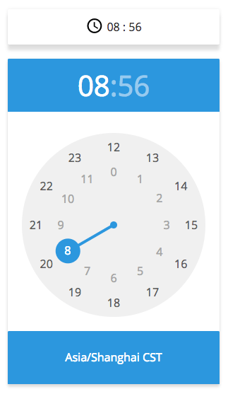
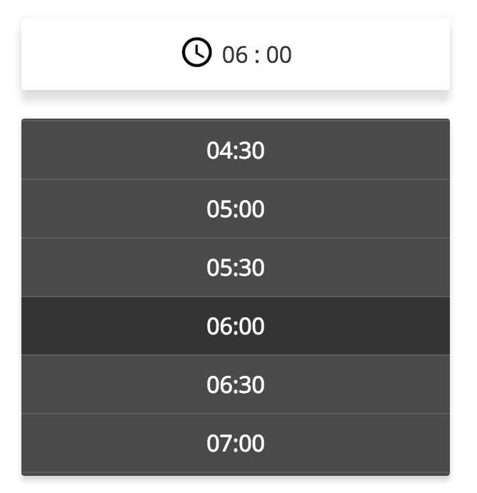

[](https://badge.fury.io/js/react-times) [](https://travis-ci.org/ecmadao/react-times) [](https://coveralls.io/github/ecmadao/react-times?branch=master) [](http://standardjs.com) [](https://www.npmjs.com/package/react-times) [](https://raw.githubusercontent.com/ecmadao/react-times/master/LICENSE)

[](https://nodei.co/npm/react-times)

README：[中文版](./README_CN.md)

> A time picker react-component, no jquery-rely, writing in es6 standard style.

**ATTENTION: new version 2.0.0 published. Check [here](./CHANGELOG.md) to see these changed props.**


# Online demo

Check [here](https://ecmadao.github.io/react-times) to play online demo.

# Play in local

```bash
$ git clone https://github.com/ecmadao/react-times.git

$ npm install

$ npm run storybook
```

# Install

dependencies:

- [`moment`](https://github.com/moment/moment/)
- [`react`](https://github.com/facebook/react)
- [`react-dom`](https://github.com/facebook/react)

> No jQuery rely 😤😤😤

So generally speaking, you should already have `react` & `react-dom` dependencies in your project. If not:

```bash
$ npm install react react-dom --save-dev
# and
$ npm install react-times --save-dev
```

# Usage

This component has two themes now: Material Theme by default, or Classic Theme.

> Always remember import css file when you use react-times

```javascript
// basic usage
// in some react component
import React from 'react';
import TimePicker from 'react-times';

// use material theme
import 'react-times/css/material/default.css';
// or you can use classic theme
import 'react-times/css/classic/default.css';

export default class SomeComponent extends React.Component {
  // do some work
  onHourChange(hour) {
    // do something
  }

  onMinuteChange(minute) {
    // do something
  }

  onTimeChange(time) {
    // do something
  }

  onFocusChange(focusStatue) {
    // do something
  }

  onMeridiemChange(meridiem) {
    // do something
  }

  render() {
    <TimePicker
      onFocusChange={this.onFocusChange.bind(this)}
      onHourChange={this.onHourChange.bind(this)}
      onMinuteChange={this.onMinuteChange.bind(this)}
      onTimeChange={this.onTimeChange.bind(this)}
      onMeridiemChange={this.onMeridiemChange.bind(this)}
    />
  }
}
```

> See more examples here:

```javascript
// some config example
render() {
  <TimePicker
      colorPalette="dark" // main color, default "light"
      focused={true} // whether to show timepicker modal after rendered. default false
      withoutIcon={true} // whether to has time icon on button, default false
      time="13:05" // initial time, default current time
      theme="material"
      // or
      // theme="classic"
      timeMode="12" // use 24 or 12 hours mode, default 24
      showTimezone=true // show the timezone, default false
      timezone="America/New_York" // what timezone to use, detects the user's local timezone by default
  />
}
```

> For more detail usage, you can visit [example](https://github.com/ecmadao/react-times/tree/master/examples) or see the source code.

# Show time

- 24 hours mode with Material Theme, light color by default

```javascript
<TimePicker />
```


- 12 hours mode with Material Theme, light color by default

```javascript
<TimePicker timeMode="12"/>
```


- 24 hours mode with Material Theme, dark color

```javascript
<TimePicker colorPalette="dark"/>
```


- 24 hours mode, showing user current timezone. (Besides, your can use `timezone` props to custom timezone)

```javascript
<TimePicker showTimezone={true}/>
```



- 24 hours mode with Classic Theme, light color by default

```javascript
<TimePicker theme="classic"/>
```


- 24 hours mode with Classic Theme, dark color

```javascript
<TimePicker colorPalette="dark" theme="classic"/>
```



# APIs

## Props

- `time`

> Initial time, must be a string, with `${hour}:${minute}` format, default now (by using `moment()`):

```javascript
// React.PropTypes.string
time="11:11"
time="11:01"
time="1:01"
time="1:1"
```

- `focused`

> Whether the timepicker pannel is focused or not when it did mount. Default `false`

```javascript
// React.PropTypes.bool
focused={false}
focused={true}
```

- `withoutIcon`

> Whether the timepicker has a svg icon. Default `false`.

```javascript
// React.PropTypes.bool
withoutIcon={true}
```

- `colorPalette`

> The main color palette of picker pannel. Default `light`.

```javascript
// React.PropTypes.string
colorPalette="dark"
colorPalette="light"
```

- `timeMode`

> Support "12" or "24" hours mode.

```javascript
// React.PropTypes.string or React.PropTypes.number
timeMode="24"
timeMode=24
timeMode="12"
timeMode=12
```

- `meridiem`

> `React.PropTypes.string`, support "PM" or "AM" for 12 hours mode, default `AM`

- `showTimezone`

> `React.PropTypes.bool`, whether show user timezone or not, default `false`

- `timezone`

> `React.PropTypes.string`, change user timezone, default user current local timezone.

- `trigger`

> `React.component`, means a DOM which can control TimePicker Modal "open" or "close" status.

```javascript
<TimePicker
  focused={focused}
  trigger={(
    <div
      onClick={this.handleFocusedChange.bind(this)} >
      click to open modal
    </div>
  )}
/>
```

- `draggable`

If you don't want to drag the pointer, then you can set `draggable` props to `false`, then users can only use click to change time. Default `true`

```
<TimePicker
  draggable={true}
/>
```

- `language`

> `React.string`, use different language. Default english.

```javascript
/*
 * support
 * en: english
 * zh-cn: 中文简体
 * zh-tw: 中文繁体
 * fr: Français
 * ja: 日本語
 */
<TimePicker
  language="zh-cn" // 中文简体
/>
```

- `phrases`

> `React.object`, specify text values to use for specific messages.  By default, phrases will be set from defaults based on language.
> Specify any of the available phrases you wish to override or all of them if your desired language is not yet supported.
> See [language.js](./src/utils/language.js) for default phrases.

```javascript
<TimePicker
  phrases={{
    confirm: 'Are you sure?',
    cancel: 'Do you want to cancel?',
    close: 'DONE',
    am: 'Ante Meridiem',
    pm: 'Post Meridiem'
  }}
/>
```

## Callback

- `onFocusChange`

`React.PropTypes.func`

> The callback func when component `focused` state is changed.

- `onHourChange`

`React.PropTypes.func`

> The callback func when component `hour` state is changed.

```javascript
onHourChange(hour) {
  // ...
}
```

- `onMinuteChange`

`React.PropTypes.func`

> The callback func when component `minute` state is changed.

```javascript
onMinuteChange(minute) {
  // ...
}
```

- `onTimeChange`

`React.PropTypes.func`

> The callback func when component `hour` or `minute` or `AM/PM` state is changed.

```javascript
onTimeChange(time) {
  // ...
}
```

- `onMeridiemChange`

`React.PropTypes.func`

> The callback func when meridiem changed.

- `onTimezoneChange`

`React.PropTypes.func`

> The callback func when timezone changed.  Receives timezone object as argument with the following properties:
* city
* zoneAbbr
* zoneName

# Article

- [一言不合造轮子--撸一个ReactTimePicker](https://github.com/ecmadao/Coding-Guide/blob/master/Notes/React/ReactJS/Write%20a%20React%20Timepicker%20Component%20hand%20by%20hand.md)

# Todos

- Test

  - [x] TimePicker Component
  - [x] PickerDragHandler Component
  - [x] PickerPointGenerator Component
  - [x] MaterialTheme Component
  - [x] TwelveHoursTheme Component
  - [x] PickerPoint Component
  - [ ] OutsideClickHandler Component

  - [x] utils test

- Color Palette (Now It has light and dark color)

  - [x] light
  - [x] dark
  - [ ] colorful

- Themes

  - [x] Material Theme
  - [x] Classical Theme

- Mode

  - [x] 12h mode
  - [x] 24h mode

- Animations

# Thx

Thanks to the Airbnb's open source project: [react-dates](https://github.com/airbnb/react-dates), I have learn a lot from that. Thanks.

# Core Contributers 🎉

- **[carlodicelico](https://github.com/carlodicelico)**
- **[erin-doyle](https://github.com/erin-doyle)**
- **[thg303](https://github.com/thg303)**
- **[naseeihity](https://github.com/naseeihity)**

# License

[MIT License](./LICENSE)
