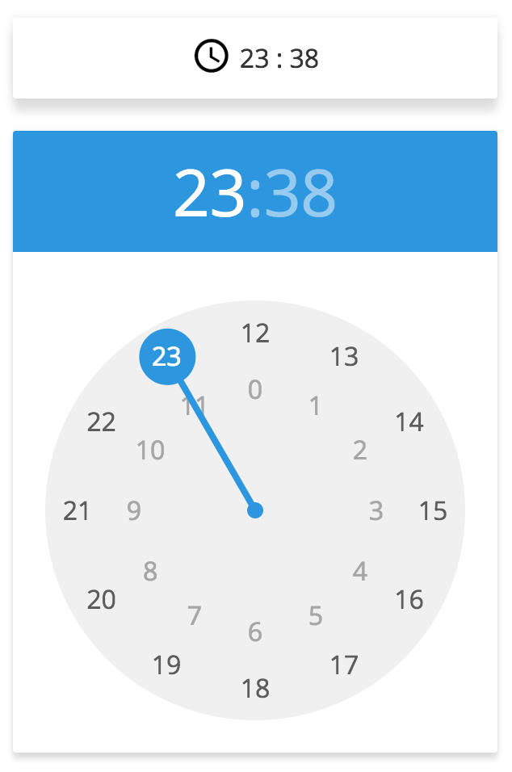
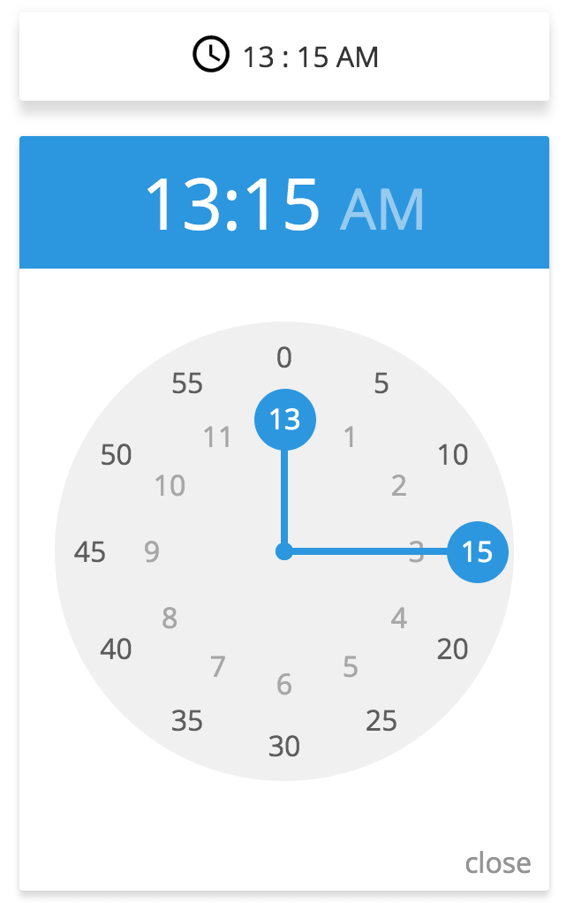
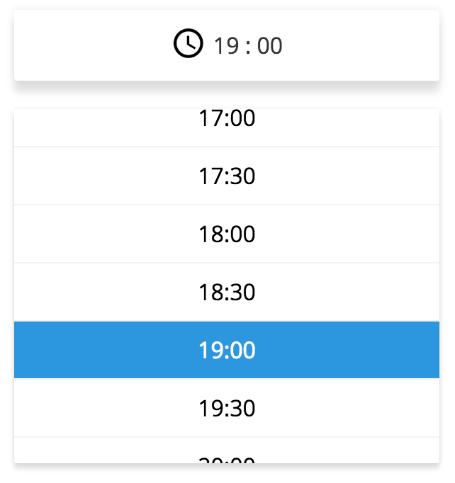

[](https://badge.fury.io/js/react-times) [](https://travis-ci.org/ecmadao/react-times) [](https://coveralls.io/github/ecmadao/react-times?branch=master) [](http://standardjs.com) [](https://www.npmjs.com/package/react-times) [](https://raw.githubusercontent.com/ecmadao/react-times/master/LICENSE)

[](https://nodei.co/npm/react-times)

README：[English Version](./README.md)

> 一个 React 时间选择器组件，使用 ES6 标准语法编写，没有 jQuery 依赖

**注: 2.0.0 新版已发布，戳 [这里](./CHANGELOG.md) 查看更改/新增的 props。**


# 线上 demo

戳[这里](https://ecmadao.github.io/react-times)玩线上 demo

# 本地玩起来

```bash
$ git clone https://github.com/ecmadao/react-times.git

$ npm install

$ npm run storybook
```

# 安装说明

单独使用插件时所需的依赖：

- [`moment`](https://github.com/moment/moment/)
- [`react`](https://github.com/facebook/react)
- [`react-dom`](https://github.com/facebook/react)

> No jQuery 😤😤😤

使用的时候，需要你的项目里已经安装了`react`和`react-dom`。如果没有的话：

```bash
$ npm install react react-dom --save-dev
# and
$ npm install react-times --save-dev
```

# 使用方式

目前组件总共有两种主题：Material 主题和经典主题

> 在使用组件的时候，记得要引入对应主题的 CSS 文件

```javascript
// 基本使用方式
// 假设要在某个组件里使用该插件 (SomeComponent)
import React from 'react';
import TimePicker from 'react-times';

// 使用 Material 主题的话引入：
import 'react-times/css/material/default.css';
// 否则经典主题的话则引入：
import 'react-times/css/classic/default.css';

export default class SomeComponent extends React.Component {
  // do some work
  onHourChange(hour) {
    // do something
  }

  onMinuteChange(minute) {
    // do something
  }

  onTimeChange(time) {
    // do something
  }

  onFocusChange(focusStatue) {
    // do something
  }

  onMeridiemChange(meridiem) {
    // do something
  }

  render() {
    <TimePicker
      onFocusChange={this.onFocusChange.bind(this)}
      onHourChange={this.onHourChange.bind(this)}
      onMinuteChange={this.onMinuteChange.bind(this)}
      onTimeChange={this.onTimeChange.bind(this)}
      onMeridiemChange={this.onMeridiemChange.bind(this)}
      // 确定主题，不填该 props 则默认为 material
      theme="material"
        // or
        // theme="classic"
    />
  }
}
```

关于配置的栗子：

```javascript
render() {
  <TimePicker
      colorPalette="dark" // main color, default "light"
      focused={true} // whether to show timepicker modal after rendered. default false
      withoutIcon={true} // whether to has time icon on button, default false
      time="13:05" // initial time, default current time
      theme="material"
      // or
      // theme="classic"
      timeMode="12" // use 24 or 12 hours mode, default 24
  />
}
```

> 你可以戳 [这里](https://github.com/ecmadao/react-times/tree/master/examples) 查看更多栗子

# 秀一下

- 24 小时制，亮色调的 Material 主题（默认）

```javascript
<TimePicker />
```



- 12 小时制，亮色调的 Material 主题

```javascript
<TimePicker timeMode="12"/>
```



- 24 小时制，暗色调的 Material 主题

```javascript
<TimePicker colorPalette="dark"/>
```


- 24 小时制，展示用户当前时区。（除此以外，可以通过 `timezone` props 来手动改变时区）

```javascript
<TimePicker showTimezone={true}/>
```


- 24 小时制，亮色调的经典主题

```javascript
<TimePicker theme="classic"/>
```



- 24 小时制，暗色调的经典主题

```javascript
<TimePicker colorPalette="dark" theme="classic"/>
```


# APIs

## Props

- `time`

> 初始化时的时间，格式是 `${hour}:${minute}`，不传则默认使用当前时间（通过`moment()`）

```javascript
// React.PropTypes.string
time="11:11"
time="11:01"
time="1:01"
time="1:1"
```

- `focused`

> 初始化时时间选择器的 modal 是否打开，默认为`false`

```javascript
// React.PropTypes.bool
focused={false}
focused={true}
```

- `withoutIcon`

> 时间选择器的按钮上是否不需要 svg icon，默认为`false`

```javascript
// React.PropTypes.bool
withoutIcon={true}
```

- `colorPalette`

> 配色方案，默认为`light`

```javascript
// React.PropTypes.string
colorPalette="dark"
colorPalette="light"
```

- `timeMode`

> 12 或 24 小时制，默认为 24

```javascript
// React.PropTypes.string or React.PropTypes.number
timeMode="24"
timeMode=24
timeMode="12"
timeMode=12
```

- `meridiem`

> 上下午，在 12 小时制里为 "AM" 或 "PM"。默认为 `AM`

- `showTimezone`

> `React.PropTypes.bool`，代表是否展示用户的时区。默认为 `false`

- `timezone`

> `React.PropTypes.string`，可以通过该 props 改变用户所处的时区。默认为用户当前本地时区。

- `trigger`

> 开启、关闭时间选择器 Modal 的触发器，是一个 React Component

```javascript
<TimePicker
  focused={focused}
  trigger={(
    <div
      onClick={this.handleFocusedChange.bind(this)} >
      click to open modal
    </div>
  )}
/>
```

- `draggable`

如果想禁用拖拽，则可以设置 `draggable` 为 `false`，那样的话用户只能通过点击来改变时间。默认为 `true`

```
<TimePicker
  draggable={true}
/>
```

- `language`

> 语言。默认为英语

```javascript
/*
 * support
 * en: english
 * zh-cn: 中文简体
 * zh-tw: 中文繁体
 * fr: Français
 * ja: 日本語
 */
<TimePicker
  language="zh-cn" // 中文简体
/>
```

- `phrases`

> `React.object`，用于自定义一些短语。可以在 [language.js](./src/utils/language.js) 查看所有的默认短语

```javascript
<TimePicker
  phrases={{
    confirm: '确认更改？',
    cancel: '确认取消？',
    close: 'DONE',
    am: '上午',
    pm: '下午'
  }}
/>
```

## 回调

- `onFocusChange`

`React.PropTypes.func`

> 当组件`focused`属性改变，也就是选择器 modal 被打开或关闭时调用

- `onHourChange`

`React.PropTypes.func`

> 小时`hour`改变时的回调

```javascript
onHourChange(hour) {
  // ...
}
```

- `onMinuteChange`

`React.PropTypes.func`

> 分钟`minute`被改变时的回调

```javascript
onMinuteChange(minute) {
  // ...
}
```

- `onTimeChange`

`React.PropTypes.func`

> 小时`hour`或者分钟`minute`被改变时的回调

```javascript
onTimeChange(time) {
  // ...
}
```

- `onMeridiemChange`

`React.PropTypes.func`

> 当 上、下午改变时触发的回调

- `onTimezoneChange`

`React.PropTypes.func`

> 当时区改变时的回调

# 相关文章

- [一言不合造轮子--撸一个ReactTimePicker](https://github.com/ecmadao/Coding-Guide/blob/master/Notes/React/ReactJS/Write%20a%20React%20Timepicker%20Component%20hand%20by%20hand.md)

# Todos

- 测试

  - [x] TimePicker Component
  - [x] PickerDragHandler Component
  - [x] PickerPointGenerator Component
  - [x] MaterialTheme Component
  - [x] TwelveHoursTheme Component
  - [x] PickerPoint Component
  - [ ] OutsideClickHandler Component

  - [x] utils test

- 配色

  - [x] light
  - [x] dark
  - [ ] colorful

- 主题

  - [x] Material Theme
  - [x] Classical Theme

- 小时制

  - [x] 12h mode
  - [x] 24h mode

- 动画

# 致谢

感谢 Airbnb 的 [react-dates](https://github.com/airbnb/react-dates) 组件，没有它我也不会想着写一个小时选择组件

# 核心贡献者 🎉

- **[carlodicelico](https://github.com/carlodicelico)**
- **[erin-doyle](https://github.com/erin-doyle)**
- **[shianqi](https://github.com/shianqi)**
- **[thg303](https://github.com/thg303)**
- **[naseeihity](https://github.com/naseeihity)**

# 版权

[MIT License](./LICENSE)
